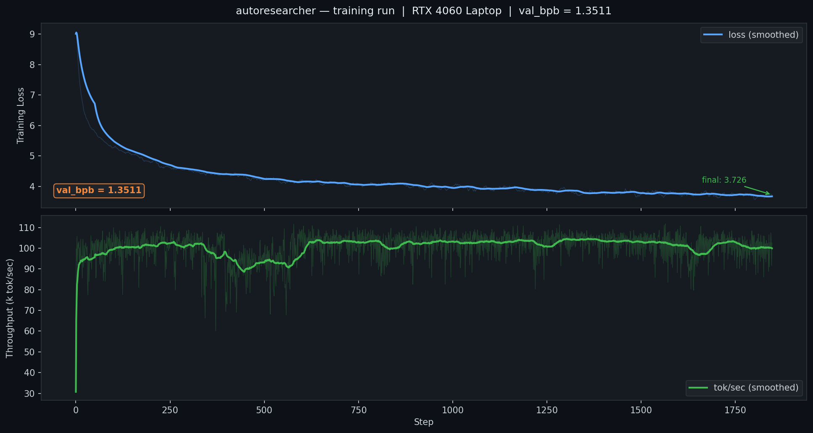
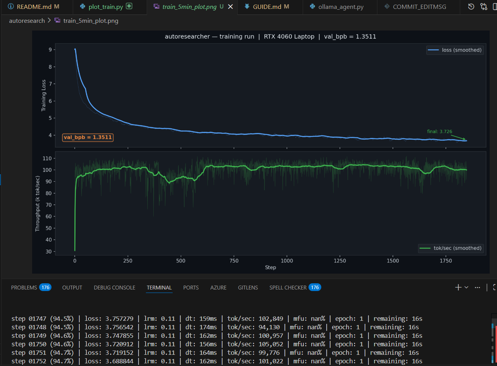
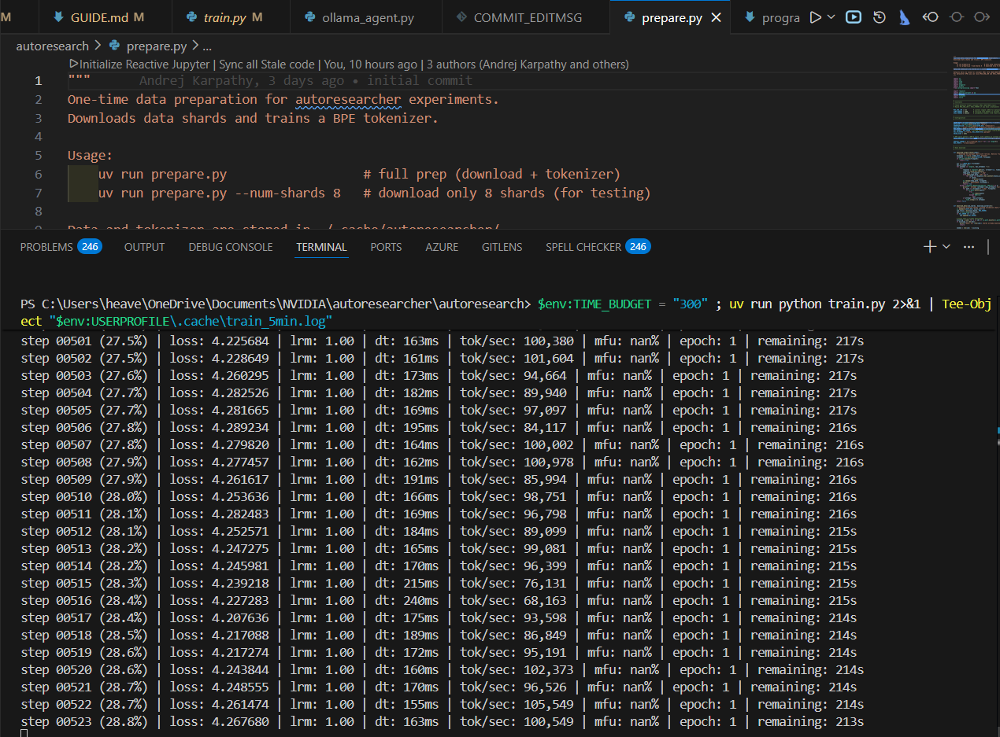

# autoresearcher

> **Karpathy's [autoresearcher](https://github.com/karpathy/autoresearcher), reimplemented to run 100% offline on consumer NVIDIA GPUs using local Ollama models.**



*Neural networks are just matrix multiplications stacked on top of each other, and somehow they work. The research process that discovers better ways to stack them is itself a loop — propose, evaluate, keep or discard. This repo automates that loop.*

*You don't need a datacenter. You don't need API credits. You need a GPU, a free evening, and the willingness to let a machine run experiments while you sleep.*

*autoresearcher edits `train.py`, trains for exactly 30 minutes, reads `val_bpb`, keeps what improved, reverts what didn't. Repeat overnight. Wake up to a better model.*

*This fork runs the entire loop on a consumer NVIDIA GPU. RTX 3060, 4060, 4070 — laptop or desktop, 8GB VRAM. The research agent is a local Ollama model. No cloud. No fees. Completely offline.*

---

## Verified Results

Smoke test on **RTX 4060 Laptop (8GB VRAM)** with `qwen2.5-coder:7b` as the agent:

| Run | Duration | Steps | val_bpb | Throughput | Peak VRAM |
|---|---|---|---|---|---|
| Smoke test | 5 min | 1,848 | **1.3511** | ~95K tok/sec | ~512 MB |



The model converges cleanly. `val_bpb = 1.3511` after just 5 minutes — a full 30-minute overnight run will push this considerably lower.

---

## The Loop

```python
while True:
    propose change to train.py      # local Ollama model reads history, proposes one edit
    train for exactly 30 minutes    # uv run train.py
    if val_bpb improved:
        keep it                     # save to train.py.best
    else:
        revert                      # restore previous version
    log result
```

That is the entire algorithm. The power is in the repetition. Each experiment is 30 minutes. Overnight you get ~16 of them. The agent builds up a history of what worked and what didn't, and its proposals get progressively more targeted.

The metric is `val_bpb` — validation bits per byte. Lower is better. It is vocabulary-size-independent, which means you can fairly compare a model with 3 attention heads against one with 6, or GELU against SiLU, without the number being contaminated by tokenizer choices.

---

## This Fork: Consumer GPUs

The original autoresearcher assumed datacenter hardware. On an H100 you have 80GB of VRAM and memory is rarely the constraint. On a laptop RTX 4060 you have 8GB, and Ollama already uses 5 of them.

This fork makes it work anyway. Four changes to the defaults:



- `DEPTH = 4` — cuts parameters by roughly 4x. The model fits in ~3GB with room to breathe.
- `MAX_SEQ_LEN = 512` — enough context for meaningful language modeling, not enough to OOM.
- `TOTAL_BATCH_SIZE = 2**14` — ~16K tokens per step, tuned for the 3GB training footprint.
- `WINDOW_PATTERN = "L"` — disables banded attention. Ampere and Ada handle sliding-window attention poorly at small batch sizes.

Ollama takes ~5GB. Training takes ~3GB. On 8GB they coexist. Barely, but reliably.

If you have any modern NVIDIA laptop or desktop GPU, this works. See `GUIDE.md` for the exact setup steps.

---

## Files

| File | Purpose |
|---|---|
| `train.py` | Model, optimizer, training loop — mutated by the agent each experiment |
| `prepare.py` | One-time data download and BPE tokenizer training |
| `program.md` | Research policy: constraints, metric, what to try — fed to the agent each iteration |
| `ollama_agent.py` | The autonomous loop: proposes, runs, evaluates, keeps or reverts |
| `GUIDE.md` | Complete setup guide for RTX 4060 8GB + Ollama |

---

## Quick Start

> Prerequisites: **Python 3.10+**, **NVIDIA GPU with CUDA drivers**.

---

### Windows (PowerShell)

```powershell
# 1. Install uv (fast Python package manager)
powershell -ExecutionPolicy ByPass -c "irm https://astral.sh/uv/install.ps1 | iex"
# Restart PowerShell after this step

# 2. Install Ollama
winget install Ollama.Ollama
# Or download from https://ollama.com/download/windows

# 3. Clone and install dependencies
git clone https://github.com/nileshsarkarRA/autoresearcher.git
cd autoresearcher
uv sync

# 4. Download training data + train tokenizer (one-time, ~2 min)
uv run python prepare.py

# 5. Pull the coding model (~4.5 GB)
ollama pull qwen2.5-coder:7b

# 6. Start Ollama — open a NEW PowerShell window and run:
ollama serve

# 7. Back in the first window — run the agent overnight
uv run python ollama_agent.py --model qwen2.5-coder:7b --experiments 50
```

---

### Linux / WSL2

```bash
# 1. Install uv
curl -LsSf https://astral.sh/uv/install.sh | sh
source ~/.bashrc

# 2. Install Ollama
curl -fsSL https://ollama.com/install.sh | sh

# 3. Clone and install dependencies
git clone https://github.com/nileshsarkarRA/autoresearcher.git
cd autoresearcher
uv sync

# 4. Download training data + train tokenizer (one-time, ~2 min)
uv run python prepare.py

# 5. Pull the coding model (~4.5 GB)
ollama pull qwen2.5-coder:7b

# 6. Start Ollama in one terminal
ollama serve

# 7. In another terminal — run the agent overnight
cd autoresearcher
uv run python ollama_agent.py --model qwen2.5-coder:7b --experiments 50

# Optional: log everything to a file
uv run python ollama_agent.py --model qwen2.5-coder:7b --experiments 50 2>&1 | tee run_$(date +%Y%m%d).log
```

---

### What it looks like when running

```
============================================================
  AutoResearcher Ollama Agent | model=qwen2.5-coder:7b | experiments=50
============================================================
[22:01:08] Model 'qwen2.5-coder:7b' is ready.
[22:01:08] Running baseline experiment to establish starting val_bpb...
[22:06:12] Training finished in 5.1min -- val_bpb = 1.4823
============================================================
  Experiment 1/50 | Best val_bpb = 1.4823
============================================================
[22:06:14] Querying qwen2.5-coder:7b...
[22:06:19] Proposal: Warmup steps are too short for this batch size...
[22:11:22] IMPROVEMENT. val_bpb=1.4701 (delta=+0.0122) -- keeping change.
```

Walk away. Come back in the morning.

---

### Check results in the morning

**Windows (PowerShell):**
```powershell
Get-Content agent_log.jsonl | python -c "
import json, sys
exps = [json.loads(l) for l in sys.stdin]
kept = [e for e in exps if e.get('kept')]
print(f'Experiments run:   {len(exps)}')
print(f'Improvements kept: {len(kept)}')
if kept:
    best = min(e['best_bpb'] for e in kept if 'best_bpb' in e)
    print(f'Best val_bpb:      {best:.4f}')
"
```

**Linux / WSL:**
```bash
cat agent_log.jsonl | python -c "
import json, sys
exps = [json.loads(l) for l in sys.stdin]
kept = [e for e in exps if e.get('kept')]
print(f'Experiments run:   {len(exps)}')
print(f'Improvements kept: {len(kept)}')
if kept:
    best = min(e['best_bpb'] for e in kept if 'best_bpb' in e)
    print(f'Best val_bpb:      {best:.4f}')
"
```

The best `train.py` is automatically saved to `train.py.best`. Your original is preserved in `train.py.baseline`.

---

## Agent Options

```bash
# Run more experiments for a longer overnight session
uv run python ollama_agent.py --experiments 100

# Use a smaller model if VRAM is tight
uv run python ollama_agent.py --model llama3.2:3b --experiments 50

# Use a remote Ollama instance
uv run python ollama_agent.py --ollama-url http://192.168.1.10:11434 --experiments 50
```

---

## Model Choices for 8GB VRAM

| Model | VRAM | Code Quality |
|---|---|---|
| `qwen2.5-coder:7b` | ~5GB | Excellent — recommended |
| `deepseek-coder:6.7b` | ~4.5GB | Excellent |
| `codellama:7b` | ~4GB | Good |
| `llama3.2:3b` | ~2GB | OK — use if VRAM is tight |

---

## Credits

This project is a consumer-GPU fork of **[Andrej Karpathy's autoresearcher](https://github.com/karpathy/autoresearcher)**. The core concept, training loop, and codebase design all come from his work. His contributions to open-source AI education — nanoGPT, minGPT, llm.c, makemore, and countless lectures — are what make projects like this possible. Go follow him.

This fork replaces the datacenter assumptions with consumer-GPU defaults, and swaps the Claude Code API agent for a local Ollama model. Everything else is faithful to the original.

---

## License

MIT
