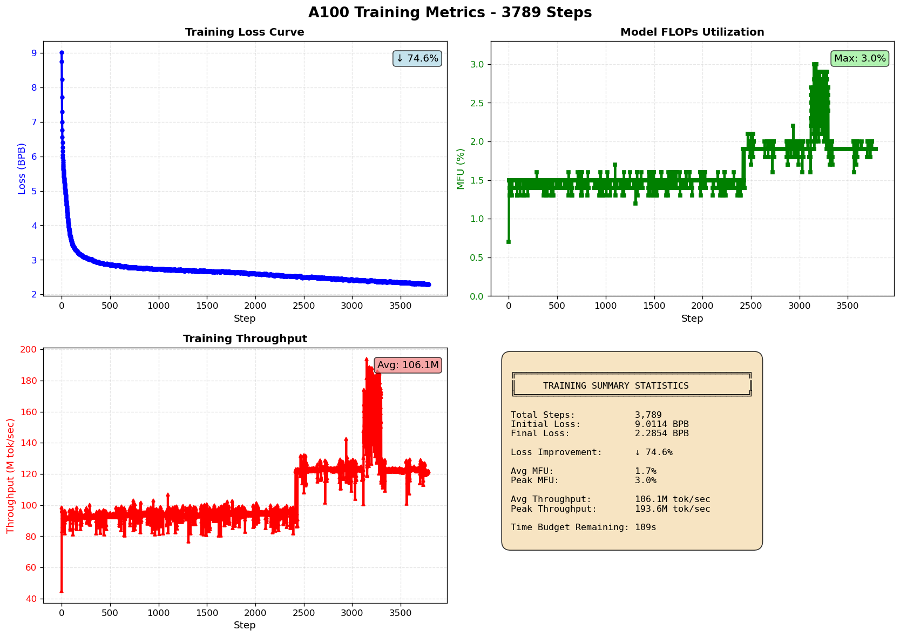

<p align="center">
  
</p>

> **Autonomous pretraining research framework with multi-GPU profile support and DeepSeek Coder integration via Ollama.**

---

## Quick Start

```bash
chmod +x autoresearcher
./autoresearcher
```

---

## 10-Hour A100 Training Run

**Session Details**

| Field | Value |
|-------|-------|
| Date | March 11, 2026 (02:01 → 12:02 UTC) |
| Hardware | NVIDIA A100 80GB SXM4 |
| Duration | 10h 0m 43s (time-budget: 36,000s) |
| Dataset | ClimbMix (10 shards) |
| Workers | 39 parallel |
| Model | depth=8, batch=96, 150,995,984 params |
| Precision | BF16 + Flash Attention v3 |
| Grad Accum | 5 steps (adjusted batch: 983,040 tokens) |

---

## Loss Convergence

| Metric | Value |
|--------|-------|
| Initial Loss (step 0) | 9.011393 BPB |
| Final Loss (step 3788) | 2.285391 BPB |
| Absolute Improvement | 6.726002 |
| **% Improvement** | **74.64%** |
| Loss Reduction Factor | 3.94× |
| Completion | 99.7% of budget used |

**Loss Trajectory**

| Stage | Steps | Loss Range | Notes |
|-------|-------|-----------|-------|
| Initialization | 0–100 | 9.011 → 3.557 | Cold start, cache warming |
| Early Training | 100–500 | 3.557 → ~3.1 | Rapid convergence |
| Mid Training | 500–2000 | ~3.1 → 2.47 | LR decay in effect |
| Late Training | 2000–3500 | 2.47 → 2.32 | Fine-tuning phase |
| Final Phase | 3500–3788 | 2.32 → 2.285 | Convergence plateau |

**Epoch Progression**

| Epoch | Step Range | Final Loss |
|-------|-----------|-----------|
| 1 | 0 – ~434 | ~3.55 |
| 2–3 | ~434 – ~1300 | ~2.8 |
| 4–6 | ~1300 – ~2800 | ~2.46 |
| 7 | ~2800 – 3655 | ~2.31 |
| 8 | 3656 – 3788 | **2.285391** |

---

## Hardware & Performance Metrics

| Metric | Peak | Average |
|--------|------|---------|
| MFU | 2.2% (step 2938, 142K tok/s) | 1.9% |
| Throughput | 142,630 tok/sec | ~122K tok/sec |
| Time per Step | ~7.5s (best) | ~8s |
| VRAM (post-build) | — | 0.5 GB allocated / 0.6 GB reserved |
| Total VRAM | 79.2 GB available | — |

---

## Training Graph



> Log: `logs/training_20260311_020053.log` · Graph generated: `2026-03-11 12:02:51`

---

## License

MIT — Based on [Andrej Karpathy's autoresearcher](https://github.com/karpathy/autoresearcher)
